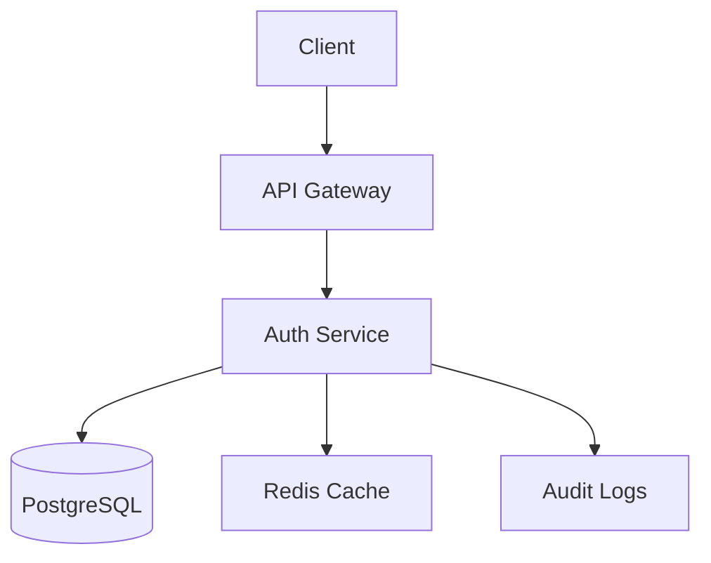

# 🔒 Privacy-Focused Authentication Microservice

Микросервис аутентификации с поддержкой **GDPR**, **WebAuthn** и современных протоколов безопасности.  
**Особенности**: анонимизация данных, шифрование чувствительной информации, защита от брутфорса.

[](https://hub.docker.com/)  
[](https://fastapi.tiangolo.com/)  
[](https://www.postgresql.org/)

---

## 🚀 Быстрый старт

### 📦 Предварительные требования

- Docker 20.10+
- Python 3.9+
- PostgreSQL 13+

### 🛠 Установка

1. Клонируйте репозиторий:
   ```bash
   git clone https://github.com/whoiamHiragana/Auth-Microservice.git
   cd Auth-Microservice
   ```

2. Создайте `.env` файл (пример в `.env.example`):
   ```bash
   echo "DATABASE_URL=postgresql+asyncpg://user:password@db:5432/auth_db
   JWT_SECRET_KEY=$(openssl rand -hex 32)
   ENCRYPTION_KEY=$(python -c 'from cryptography.fernet import Fernet; print(Fernet.generate_key().decode())')" > .env
   ```

3. Запустите сервис:
   ```bash
   docker-compose up --build
   ```

Сервис будет доступен по адресу: [http://localhost:8000](http://localhost:8000)

---

## 📚 Документация API

- Swagger UI: [`/docs`](http://localhost:8000/docs)
- ReDoc: [`/redoc`](http://localhost:8000/redoc)

---

## 🌟 Основные возможности

### 🔐 Безопасность

- GDPR-совместимость: анонимизация вместо удаления, запланированное удаление данных
- WebAuthn: аутентификация без паролей через биометрию/аппаратные ключи
- Шифрование: чувствительные данные (например, email) хранятся в зашифрованном виде

### 📡 Протоколы

- OAuth2 (RFC 6749)
- JWT (RFC 7519) с коротким временем жизни токенов
- CORS: доступ только с доверенных доменов

### 📈 Мониторинг

- Встроенные метрики Prometheus (`/metrics`)
- Логирование всех аутентификационных событий

---

## 🛠 Примеры использования

### Получение JWT-токена
```bash
curl -X POST "http://localhost:8000/auth/token" \
  -H "Content-Type: application/x-www-form-urlencoded" \
  -d "username=user@example.com&password=secret"
```

### Удаление пользователя (GDPR)
```bash
curl -X DELETE "http://localhost:8000/users/{user_id}" \
  -H "Authorization: Bearer YOUR_JWT_TOKEN"
```

---

## 🧩 Архитектура



> 💡 Чтобы активировать Mermaid-диаграмму на GitHub, установите [Mermaid расширение для браузера](https://github.com/mermaid-js/mermaid).

---

## ⚙️ Для разработчиков

### Установка зависимостей
```bash
python -m pip install -r requirements.txt
```

### Запуск тестов
```bash
pytest -v tests/
```

### Миграции БД
```bash
alembic upgrade head
```

---

## 📄 Лицензия

MIT License · Подробнее в файле `LICENSE`
